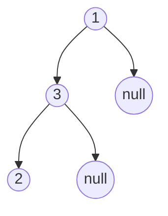
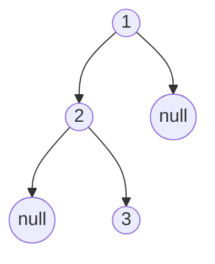

# 95. 不同的二叉搜索树 II
给你一个整数 `n` ，请你生成并返回所有由 `n` 个节点组成且节点值从 `1` 到 `n` 互不相同的不同 **二叉搜索树** 。可以按**任意顺序**返回答案。

**示例1:**

```mermaid
graph TB
1((1)) --> 3((3))
1 --> null1((null))
3 --> 2((2))
3 --> null2((null))
```

```mermaid
graph TB
1((1))
2((2))
3((3))
1 --> n1((null))
1 --> 2
2 --> n2((null))
2 --> 3
```

