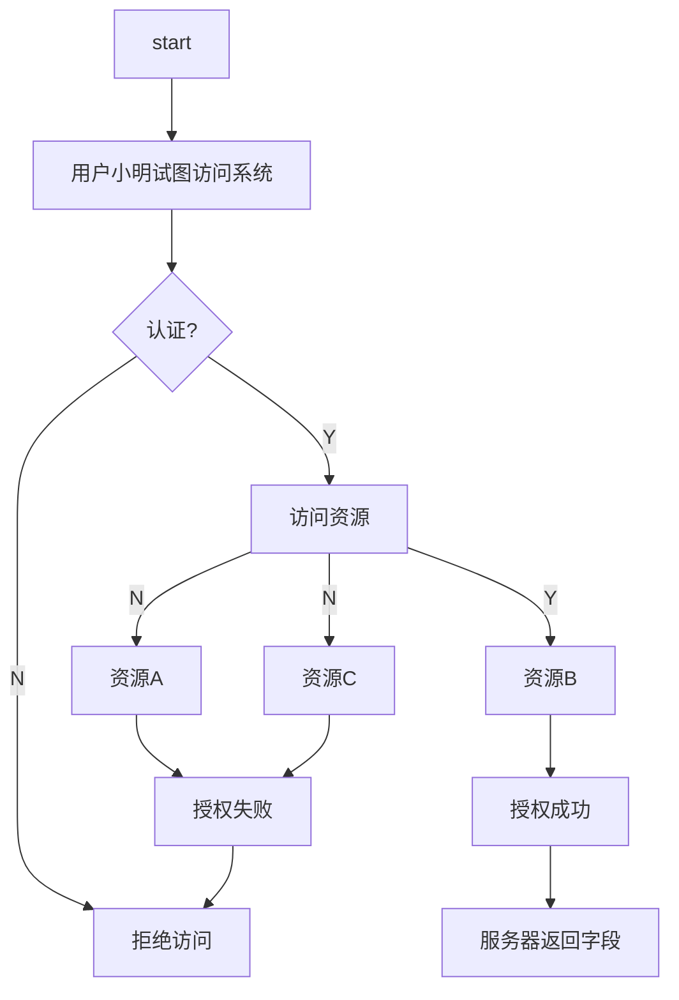

# 网络认证
## 认证与授权的区别
- 认证 **认证**用来验证摸个用户是否允许访问系统的权限。仅当用户通过通过认证时，才会有系统资源的增删改查权限。
- 授权 **授权**指当用户通过认证时，用来验证用户是否具有权限来访问某一个具体资源。如果用户授权通过，则该用户就能对字段做增删改查的操作。

```mermaid  {align=center}
graph TB
    A[start] --> B[用户小明试图访问系统]
    B --> C{认证?}
    C -->|N| D[拒绝访问]
    C -->|Y| Acc[访问资源]
    Acc -->|N| E[资源A]
    Acc -->|Y| G[资源B]
    Acc -->|N| H[资源C]
    G --> F[授权成功]
    E --> I[授权失败]
    H --> I[授权失败]
    I --> D
    F --> 服务器返回字段
```