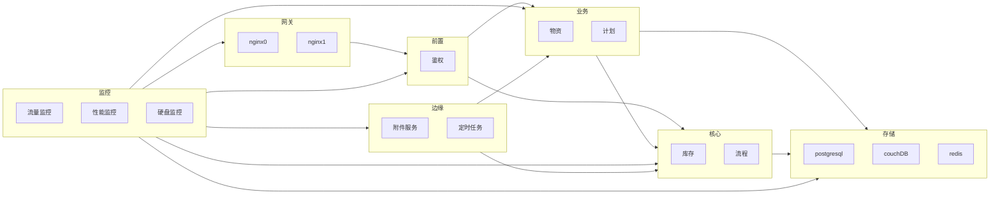
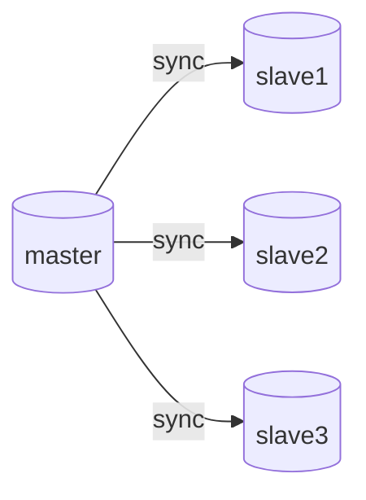
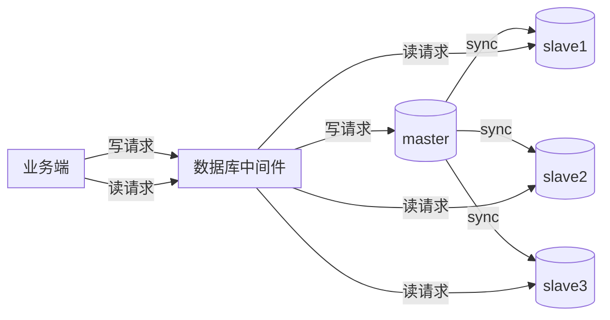
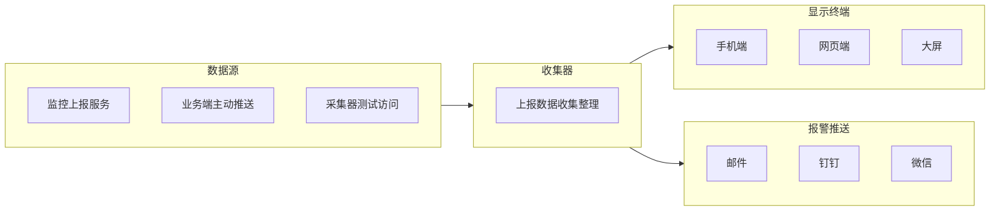
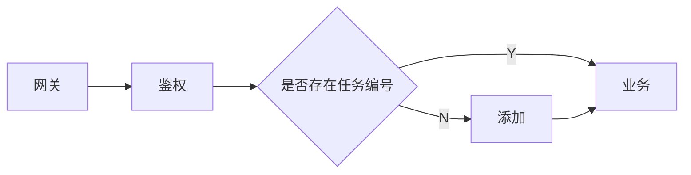

# 答辩

## 产品架构

### 存在的问题

1. 现有设计上存在大而全的偏好,未进行合理的服务划分.
2. 服务部署时,影响范围过大
3. 没有容灾方案
4. 没有良好的环境隔离
5. 服务的各项指标没有监控预警,需要依靠客户发现

### 改进方案

1. 针对服务分层问题,可以通过评估各个功能模块之间的边界,先做粗略划分.然后随着对产品的理解逐渐加深,一步步细致拆分.

在实践中,我们需要先明确我们的核心功能是什么.而什么外部衍生功能.

例如对于物资管理: 核心功能点是库存,入库和出库的数量准确,并且这个核心功能与具体的业务无关,也不会频繁更新.

然后基于库存这个核心,我们可以衍生出库存统计,采购,领用等等功能.

除此之外,对于用户鉴权,附件文档的上传下载等这些边缘功能也可以被独立在核心功能之外,这类功能一旦稳定运行,基本不会再有大的改动.独立部署这些服务可以保证我们在频繁更新业务代码时,这类服务能稳定运行.



2. 对于容灾方面,可以做到业务服务多点部署,数据库服务读写分离,做成一主多备的形式.

数据库方面: 



读写分离: 主数据负责数据写入,通过`wal`日志将写入的操作同步至各个从数据库中.对如业务端的查询请求,由各个从数据库分担.为实现这部分功能,需要一个数据库连接中间件来完成负载均衡.



3. 区分线上生产环境和测试环境,方便做全链路仿真测试.
4. 划定各项监控指标,对硬件和系统做尽可能详尽的监控,如网络流量,数据库查询QPS,数据库慢查询,数据库总连接数,接口平均响应时间,总请求数量,有效请求数量等等.并对异常情况及时报警.



5. 日志统一格式收集分析,做日志的完整调用链记录,在发生服务异常时能快速定位并处理.
   

业务服务在互相调用时需要透传任务编号,并且在记录日志时需要将任务编号也一并记录.

日志格式可以为:
```json
{
    "type":"INGO/WARNING/ERROR",
    "task":"2dc2591c-f67b-458e-9e0c-58ceef6f6692",
    "message":"INFO 2022-08-23 10:24:07 user XXX login in",
    "timestamp":1661221379,
    "detail":"error track"
}
```


   
## 生产流程

### 存在的问题

1. 产品经理过于追求一次到位的开发,导致开发流程过长
2. 产品经理直接向开发人员提出需求修改,没有全局的功能评估
3. 需求文档给出的需求过于繁杂,开发人员理解困难
4. 开发过程文档缺失


### 改进方案

1. 对于产品提出的需求过大和开发人员无法更好理解的问题,可以由研发主管牵头评估,将一个大的需求拆分成多个子需求,并且明确各个子需求之间的主次关系.然后再安排开发计划,而不再是由开发人员自己理解产品需求文档.
2. 过程文档缺失的问题需要明确一点,在实际进行开发之前,需要先将技术文档大致写完,具体的实现过程可以在实现过程中补充.但大致的实现思路要先想好,并落实在纸面上.交由主管评估优劣,确定方案后再实施.

对于需要前后端配合开发的,需要在开始工作之前,将各个需要用到的接口先明确落实,包括需要用到的数据结构.如果工作过程中出现接口改动,需要先将文档修改,并通知相关的同事此次更改.

3. 对于已有功能的修改,需要先对修改所产生的影响范围做出评价.可以由产品,研发主管,开发人员共同探讨,如果存在影响范围过大,可以扩大会议范围,将涉及到的功能模块对应的负责同事拉入会议中.然后确定修改方案,再实施落实,所有涉及修改的研发同事配合完成.
4. 划定阶段性目标,确定迭代周期.例如我们以两周为一次迭代周期,那么每一个开发任务的时间跨度都最好在这个周期内.如果当前周期的开发任务已满,则非紧急任务,不在本周期内增加开发任务.如果确实需要紧急插入任务,那么适当的将一部分任务安排至下一开发周期.开发周期时间固定,不论当前周期内所有任务是否完成,都需要进行一次迭代.**线上BUG不计入周期**
